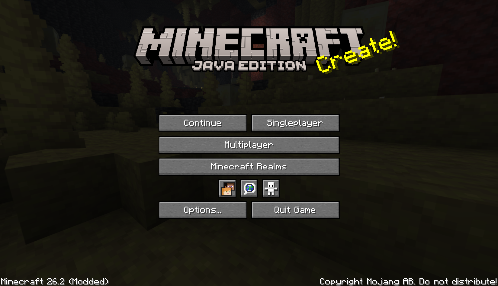

# Continue Button Continued

A lightweight Fabric client mod that adds a **Continue** button to Minecraft's main menu.

Continue Button Continued remembers the last singleplayer world or multiplayer server you joined, then lets you jump
back in with one click from the title screen.



## Features

- Adds a compact **Continue** button to the main menu.
- Opens the last played singleplayer world automatically.
- Reconnects to the last joined multiplayer server automatically.
- Falls back to the world/server selection screen when the saved target is missing.
- Shows helpful tooltips for the saved world or server.
- Pings the last multiplayer server before showing its status tooltip.
- Migrates legacy `continuebutton` configuration to `continuebuttoncontinued` when possible.
- Client-side only; servers do not need to install this mod.
- Includes translations for multiple languages.

## Installation

1. Put the Continue Button Continued `.jar` file into your `mods` folder.
2. Start the game and use the **Continue** button on the main menu.

## Configuration

The mod stores its last target in:

```text
.minecraft/config/continuebuttoncontinued/config.properties
```

Older Continue Button installations used:

```text
.minecraft/config/continuebutton/config.properties
```

On first launch, Continue Button Continued attempts to copy the legacy configuration into the new location so existing
users can keep their last saved world or server.

## Building from source

This project uses Gradle.

```bash
./gradlew clean build
```

On Windows:

```powershell
.\gradlew.bat clean build
```

The built mod jar will be generated in:

```text
build/libs/
```

## Credits

Continue Button Continued is a continued fork of **[Continue Button](https://githubcom/umollu/continue-button)** by
**umollu**.

## License

This project is licensed under the MIT License.

The original Continue Button copyright notice is preserved in [
`LICENSE`](https://github.com/Likos-Lupus/continue-button-continued/blob/main/LICENSE), and the continued project
copyright notice has been added there as well.
